<div align="right">

[](https://www.python.org/downloads/)
[](LICENSE)
[](https://github.com/psf/black)
[](https://github.com/toxicwind/hls-proxy-aggregator/tree/main/src)

</div>

# 🎬 HLS Proxy Aggregator

> **Netflix-grade HLS proxy aggregator with real-time SCTE-35 commercial removal.** Feed it raw M3U playlists; get back clean, deduplicated, quality-scored HLS — with the ad breaks surgically removed.

Raw M3U sources are messy: dead links, duplicate channels, SD streams masquerading as HD, and commercial breaks baked into the segments. This proxy sits in front of them, validates every upstream concurrently, strips SCTE-35 ad markers at the binary level, rewrites the manifests with fixed sequence numbers, and serves one clean `/playlist.m3u8`.

---

## ✨ Features

| Feature | What it does |
|---------|--------------|
| 🎥 **SCTE-35 parsing** | Binary `splice_info_section` decoder with PTS duration extraction |
| 🧹 **Commercial removal** | Real-time CUE-OUT/CUE-IN stripping with manifest sequence rewriting |
| ⚡ **Async validation** | 100-concurrent upstream URL health checks (`aiohttp`), exponential backoff |
| 🏆 **Quality scoring** | FHD (100pts) > HD (70pts) > SD (40pts) > Low (10pts) — best stream wins |
| 🌍 **CDN detection** | Akamai, CloudFront, Fastly header analysis |
| 📊 **Prometheus metrics** | `/metrics` endpoint: request/response/latency stats |
| 🔁 **Retry + cache** | Failed upstreams retried with backoff; latency tracked per source |

## Diagram

```mermaid
flowchart LR
    A["raw M3U sources"] --> B["m3u_loader<br/>streaming parser"]
    B --> C["playlist_engine<br/>dedupe + quality score"]
    C --> D["scte_parser<br/>binary splice_info_section"]
    D -->|"CUE-OUT / CUE-IN"| E["manifest rewrite<br/>sequence fix"]
    E --> F["url_validator<br/>100-concurrent health checks"]
    F --> G["/playlist.m3u8<br/>/category/*.m3u8"]
    G --> H["📺 player"]
    style D fill:#4a1a1a,stroke:#d94a4a
```



## ⚡ Quick start

```bash
git clone https://github.com/toxicwind/hls-proxy-aggregator.git && cd hls-proxy-aggregator
pip install -r requirements.txt
python3 -m src.main --port 9223
```

```bash
curl http://localhost:9223/playlist.m3u8   # clean aggregated playlist
curl http://localhost:9223/health           # liveness
curl http://localhost:9223/metrics          # prometheus stats
```

(`run.sh` launches inside an auto-created venv if you prefer zero setup.)

## 🏗 Architecture

```
hls-proxy-aggregator/
├── src/
│   ├── main.py              # entry point (argparse: --host/--port/--config/--source)
│   ├── scte_parser.py       # SCTE-35 binary splice_info_section decoder
│   ├── url_validator.py     # async upstream health checker (100 concurrent)
│   ├── playlist_engine.py   # consolidator / deduplicator / quality scorer
│   ├── proxy_server.py      # aiohttp server: /playlist.m3u8, /category/*, /health, /metrics
│   ├── m3u_loader.py        # streaming M3U parser
│   └── db_builder.py        # JSONL stream database builder
├── helpers/
│   └── auto_lint.py         # syntax validator + auto-fixer
├── config.yaml              # central configuration
├── requirements.txt         # dependencies
└── run.sh                   # auto-venv launcher
```

**Pipeline:** raw M3U → streaming parse → dedupe → quality score → SCTE-35 CUE-OUT/IN detection → manifest rewrite with sequence-number fix → clean M3U8 output. Upstream validation runs async with retry, cache, and per-source latency tracking.

## 🔧 Configuration

`config.yaml` controls:

- Server bind host/port
- SCTE-35 marker detection sensitivity
- URL validation timeouts and concurrency
- Quality scoring tiers
- Cache TTLs

## 🤝 Contributing

See [CONTRIBUTING.md](CONTRIBUTING.md). Run `helpers/auto_lint.py` before pushing.

## 📜 License + Security

**MIT** — see [LICENSE](LICENSE).

**Security posture:**
- The proxy fetches arbitrary upstream URLs — run it behind your own network boundary, not on the open internet
- No credentials are required or stored; `config.yaml` holds only tuning knobs
- Dependencies are pinned in `requirements.txt`; `helpers/auto_lint.py` validates syntax pre-commit
